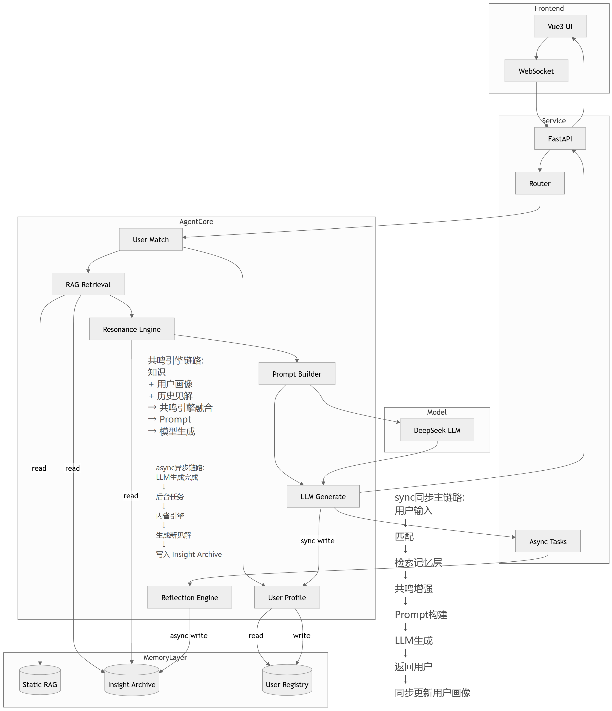
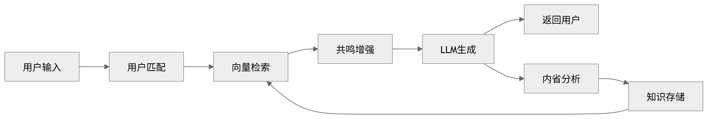
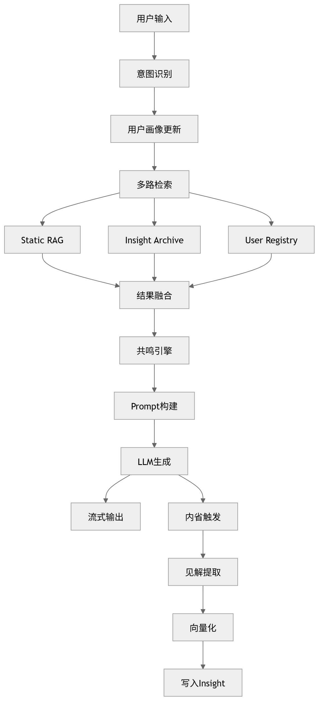
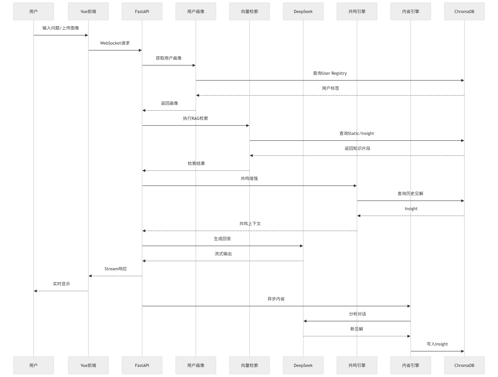

# VL-RAG-System 架构设计文档

本文档定义了“技心”多模态交互机器人的整体技术方案、模块规范及数据流转逻辑。

---

## 1. 核心架构图 (Core Architecture Diagrams)

<<<<<<< Updated upstream
### 2.1 检索系统 (Retrieval System)
**文件**: `rag/retriever.py`  
**职责**: 基于结构化知识库执行多阶段RAG检索流程，从知识库中召回与当前问题最相关的展品信息，并通过混合检索与重排序机制提升检索结果的准确性与相关性。

**核心接口**:
- `retrieve(query, top_k)` — 执行完整检索流程（向量检索 + 可选BM25 + 重排序），返回相关知识片段  
- `rerank(query, candidates)` — 对候选结果进行语义重排序  
- `get_stats()` — 获取知识库统计信息

### 2.2 记忆系统 (Memory System)
**文件**: `services/memory_service.py`  
**职责**: 管理短期对话流与长期用户知识沉淀。

**全局状态**:
- `short_term_buffer`: List[Message] — 滑动窗口式的短时对话缓冲

**核心接口**:
- `fetch_history(user_id)` — 获取指定用户的对话历史
- `commit_turn(user_id, turn_data)` — 将一轮对话存入持久化记忆

### 2.3 共鸣引擎 (Resonance Engine)
**文件**: `services/resonance_engine.py`  
**职责**: 实现“技心”人设的人格化算法，调节回应的情感质感与美学比重。

**核心接口**:
- `calculate_vibe(text_input)` — 评估交互内容的情感共鸣分值
- `apply_persona_filter(raw_response)` — 将生成的原始文本通过人设协议进行滤镜化处理
=======
### 1.1 系统全局架构


### 1.2 逻辑调用流程


>>>>>>> Stashed changes

---

## 2. 架构分层 (Architectural Layers)

系统采用高度解耦的四层架构设计，确保各组件独立演进：

1.  **感官层 (Perception Layer)**: `ASR` (听觉) 与 `Vision` (视觉) 服务，负责原始环境信号的数字化。
2.  **认知层 (Cognitive Layer)**: `LLM` (语言大脑) 与 `RAG` (知识库)，负责语义解析、知识检索与逻辑推理。
3.  **调度层 (Orchestration Layer)**: `System Orchestrator` (总控)，负责跨模块的状态机维护及 `Agent` 任务编排。
4.  **反馈层 (Execution Layer)**: `TTS` 与语音播报指令，完成交互闭环。

---

## 3. 详细模块设计 (Detailed Module Design)

### 3.1 系统总控 (System Orchestrator)
- **文件**: `local_model_processor.py`
- **职责**: 全局状态机，协调感知输入、智能决策与执行层调度，充当整个机器人的“中枢神经”。
- **持有的子系统**: Language, Retrieval, Memory, Resonance, Vision, Hearing, TTS.
- **核心接口**: `start_orchestration()`, `process_input()`, `reset_session()`

### 3.2 认知引擎模块 (Cognitive Engines)
#### 3.2.1 检索系统 (Retrieval System)
- **文件**: `rag/retriever.py`
- **职责**: 负责从向量知识库中召回与当前问题最相关的展品专业背景。
- **核心接口**: `retrieve(query, top_k)`, `rebuild_index()`

#### 3.2.2 记忆系统 (Memory System)
- **目录位置**: `memory/` (根文件夹)
- **职责**: 管理跨时空的对话上下文、长期洞察积淀与用户信息。

**核心子模块**:
1.  **static_RAG (静态检索层)**: `memory/static_rag.py` — 存储馆内 80+ 件展品的标准引导逻辑。
2.  **Insight_Archive (洞察存档层)**: `memory/insight_archive.py` — 自动化提取交互特征与对话摘要。
3.  **User Registry (用户注册中心)**: `memory/user_registry.py` — 维护用户画像与个性化配置中心。

**核心接口**:
- `fetch_history(user_id)` ⮕ 获取长/短对话上下文。
- `commit_insight(user_id, turn_data)` ⮕ 存入 Insight 归集。
- `sync_registry(user_id)` ⮕ 更新用户画像数据。

#### 3.2.3 共鸣引擎 (Resonance Engine)
- **文件**: `services/resonance_engine.py`
- **职责**: 实现“技心”人设的人格化算法，调节回应的情感质感与美学比重。
- **核心接口**: `calculate_vibe(text_input)`, `apply_persona_filter(raw_response)`

### 3.3 感知与执行模块 (Perception & Execution)
#### 3.3.1 视觉系统 (Vision System)
- **文件**: `services/vision_service.py`
- **职责**: 负责实时摄像头流的捕捉、快照分析及展品特征提取。
- **核心接口**: `capture_snapshot()`, `get_latest_frame()`

#### 3.3.2 听觉系统 (Hearing System)
- **文件**: `services/asr_service.py`
- **职责**: 负责音频降噪、语义断句及文字转化 (ASR)。
- **核心接口**: `start_listening()`, `stop_listening()`

#### 3.3.3 语言系统 (Language System)
- **文件**: `services/llm_service.py`
- **职责**: 负责大模型的底层调用、流式输出管理及提示词注入。
- **核心接口**: `generate_stream(prompts, history)`, `generate_sync(prompts)`

---

## 4. 模块交互与数据流 (Interaction & Data Flow)

### 4.1 交互时序图


### 4.2 数据流描述
1.  **语音唤醒**: 听觉系统解析语音 ⮕ 转化为文本 ⮕ 发布到 ROS 话题。
2.  **视觉捕捉**: 总控监听话题 ⮕ 触发视觉系统拍摄最新帧图像。
3.  **检索召回**: 总控将文本与图像特征传给 RAG ⮕ 提取展品专业背景。
4.  **智慧生成**: 语言系统整合背景、人设与历史 ⮕ 产生流式响应内容。
5.  **反馈输出**: 响应内容推送到前端显示，并触发 TTS 进行语音播报。

---

## 5. 目录结构 (Directory Structure)

```text
vl-rag-system/
├── services/                # 🧱 核心服务层 (业务逻辑与节点封装)
│   ├── llm_service.py       # 🧠 语言大脑与 RAG 枢纽
│   ├── tts_service.py       # 🔊 语音合成输出
│   ├── asr_service.py       # 🎙️ 听觉识别服务
│   └── vision_service.py    # 📸 视觉捕捉服务
├── memory/                  # 🧠 记忆系统 (根目录级核心模块)
│   ├── static_rag.py        # 📚 静态检索与常识库
│   ├── insight_archive.py   # 📁 对话洞察与交互档案
│   └── user_registry.py     # 👥 用户画像与注册中心
├── local_model_processor.py # 🤖 系统总控调度器 (Orchestrator)
├── main.py                  # 🌐 Web 后端 API 入口
├── config.py                # ⚙️ 全局配置中心
├── rag/                     # 📚 RAG 检索逻辑与知识管理
├── prompts/                 # 📝 提示词模板 (人设协议)
├── docs/                    # 📂 架构图、时序图与设计文档
├── data/                    # 💾 数据库与临时缓存
└── models/                  # 🤖 本地模型存放 (Embedding 等)
```

---

## 6. 技术选型 (Technology Stack)

| 核心维度 | 技术选型 | 作用说明 |
| :--- | :--- | :--- |
| **机器人框架** | ROS 2 Humble | 组件化异步通信与硬件节点管理 |
| **后端框架** | Python + FastAPI | 高性能、异步化的业务逻辑支撑 |
| **多模态核心** | DeepSeek / Qwen | 核心的语义理解、推理与视觉对齐 |
| **推理引擎** | Ollama / API | 驱动大语言模型的高效运行 |
| **向量数据库** | ChromaDB | 实时的展品专业知识向量检索 |
| **嵌入模型** | BGE-Small-ZH | 本地化的中文语义向量化 |
| **前端展现** | HTML + Vue 3 | 现代、组件化的交互式仪表盘与视觉反馈 |
